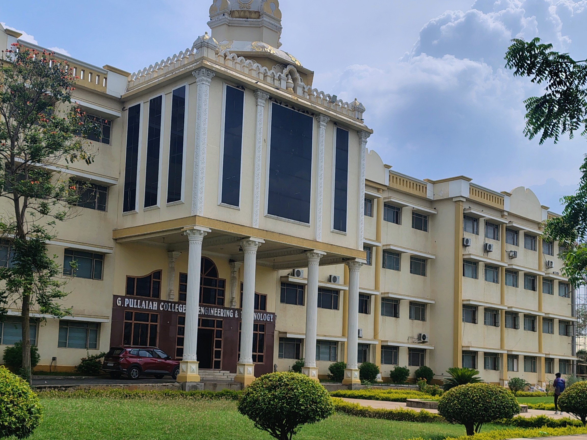
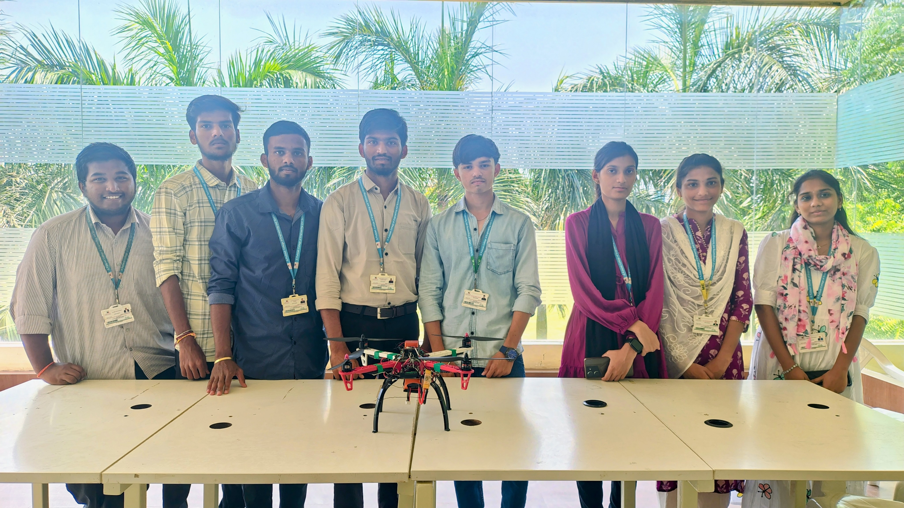

# 🚁 Autonomous Quadcopter Drone for GPS-Denied Environments – IRoC-U 2025

### A project by **Team AetherX**  
*Participant in ISRO Robotics Challenge 2025 - IRoC-U 2025*  
  
---

## 👨‍🔧 Developed By
**G.Pullaiah College Of Engineering And Technology**  
*MSMF Space Research Club Students*

*GUNI REDDY CHARAN KUMAR REDDY*  
I am a core team member of the MSMF Space Research Club, currently pursuing B-Tech Final year at G.Pullaiah College of Engineering and Technology. As part of the Autonomous Drone development team for the ISRO-U 2025 Drone Challenge.  
Role: *Embedded Systems & Hardware integration*  
Responsibilities:
- Embedded Wiring & Sensor Integration  
- Wired Communication Protocols (UART, USB-TTL, Telemetry)  
- Mission Planner Configuration & Tuning  
- Autonomous Flight Scripting with MAVLink (Python)  

---

##  Project Overview

It is a quadrotor drone developed to perform **fully autonomous flight operations in GPS-denied indoor environments**.  
It was designed and built for the **ISRO-U 2025 Drone Challenge**, reaching **Round 2** where it successfully demonstrated:

- Autonomous Takeoff  
- Hovering for 30 seconds  
- Controlled Landing  
- Emergency landing (partial implementation)

---

##  Architecture Summary

### ⚙️ Hardware Components
| Component                  | Description                              |
|---------------------------|------------------------------------------|
| Frame                     | DJI F450                                  |
| Motors                    | Emax 935kV Brushless Motors               |
| ESCs                      | Hobbywing 40A                             |
| Propellers                | Carbon Fiber                              |
| Battery                   | 5200mAh 4S LiPo                           |
| Flight Controller         | CubePilot Orange                          |
| Companion Computer        | Raspberry Pi 5                            |
| Camera                    | Raspberry Pi Camera Module 3              |
| Altitude Sensor           | Barometer in CubePilot                    |
| Position Sensor           | HereFlow Optical Flow Sensor              |
| Communication             | Telemetry (UART), USB-TTL, MAVLink        |
---

## System Architecture

  
---

##  System Integration

- **Communication Protocols**:
  - MAVLink (USB-TTL between Raspberry Pi and CubePilot)
  - Telemetry (UART) for real-time GCS monitoring
- **Mission Software**:
  - [ArduPilot](https://ardupilot.org/planner/)
- **Autonomous Control**:
  - Python scripts running on Raspberry Pi
  - Used MAVROS and DroneKit for ROS-based flight command automation
- **Failsafes**:
  - Battery monitoring
  - Emergency auto-landing

---

##  Software Architecture

- **OS**: Raspberry Pi OS (64-bit)
- **Libraries**: MAVROS, MAVSDK, DroneKit, ROS Noetic
- **Control Flow**:
  - Single auto-start command → Takeoff → Hover → Land
  - Loiter mode is enabled using Optical Flow
- **Flight Modes**:  
  - `OFFBOARD` (via MAVROS)  
  - `ALTHOLD`, `LOITER` for stability in GPS-denied environments  
- **Failsafe Scripts**:  
  - Safe descent & landing if anomalies detected
---

##  Flowchart

  
> Autonomous Mode Flowchart with Sensor Integration
---

##  Testing & Results

| Test | Outcome |
|------|---------|
| Motor & ESC Calibration | Fixed yaw instability, balanced thrust |
| Altitude Hold Mode | Stable hover using LiDAR & PID tuning |
| Initial Autonomous Takeoff | Achieved, but required script corrections |
| 10s Autonomous Hover | Success with ALTHOLD mode |
| Final Test (30s Hover + Loiter Landing) | Fully successful |

---   

##  Achievements & Status

-  Successfully completed **Round 1**
-  Reached **Round 2** (Qualification)
-  Implemented **Autonomous Takeoff**, **Hover**, **Smooth Landing**
-  Emergency Handling Partially Implemented
-  Did not qualify for Round 3

---

##  Future Work

- Add full SLAM & obstacle avoidance
- Extend flight time and payload handling
- Add computer vision for dynamic environments
  
---
## 👨‍🔧 Developed at
**G.Pullaiah College Of Engineering And Technology**  

  

*MSMF Space Research Club Students*

*Team AetherX*
  

---

## 🧑‍💻 About Me:
Aspiring Embedded System Developer, Drone Technology & IoT Enthusiast

**GUNI REDDY CHARAN KUMAR REDDY**  
📧 charanreddy2908@gmail.com  
🔗 [LinkedIn](https://www.linkedin.com/in/guni-reddy-charan-kumar-reddy-ba2414240)

